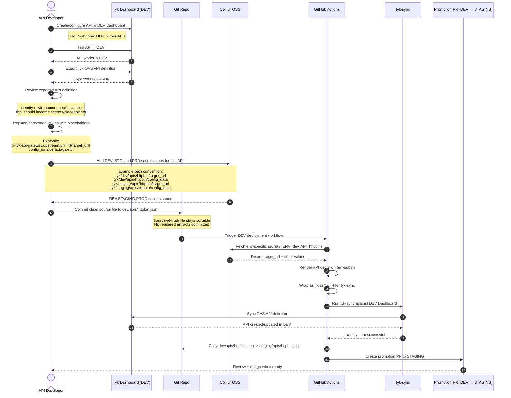

 ## CI/CD Conjur Example — Tyk API Deployment Pipeline (Work In Progress)                                                                                                                                                                                  
                                                                                                                                                                                                                                                    
  A reference implementation for deploying API definitions across multiple environments using **Tyk API Gateway** and **CyberArk Conjur** for secrets management. This repo demonstrates a GitOps-style promotion workflow (dev → staging → prod)   
  with automated CI/CD via GitHub Actions.                                                                                                                                                                                                          
                                                                                                                                                                                                                                                    
  ## Overview                                                                                                                                                                                                                                       
                                                                                                                                                                                                                                                    
  This repository looks show a way to solve for a common deployment challenge: How to securely deploy API configurations across environments without hardcoding values or sharing sensitive data. We solve for this by resolving configuration values at deploy time by pulling values from Conjur via [Summon](https://cyberark.github.io/summon/).                                                                                                                                                              
                                                                                                                                                                                                                                                    
  The pipeline:                                                                                                                                                                                                                                     
  1. Retrieve secrets from Conjur at deploy time                                                                                                                                                                                                   
  2. Render templated API definitions with resolved values                                                                                                                                                                                         
  3. Sync the rendered APIs to the Tyk Dashboard using `tyk-sync`                                                                                                                                                                                  
  4. Automatically creates a promotion PR from dev → staging                                                                                                                                                                                        
                                                                                                                                                                                                                                                    
  ## Deployment Architecture                                                                                                                                                                                                                                   
  ```                                                                                                                                                                                                                                                  
  GitHub Actions                                                                                                                                                                                                                                    
      │                                                                                                                                                                                                                                             
      ├── Summon + summon-conjur ──► CyberArk Conjur (secrets)                                                                                                                                                                                      
      │                                      │                                                                                                                                                                                                      
      │                               secret values injected                                                                                                                                                                                        
      │                                      │                                                                                                                                                                                                      
      ├── envsubst ◄─────────────── API JSON templates                                                                                                                                                                                              
      │       │                                                                                                                                                                                                                                     
      │       └── rendered-apis/ ──► tyk-sync ──► Tyk Dashboard                                                                                                                                                                                     
      │                                                                                                                                                                                                                                             
      └── Auto-promotion PR (dev → staging)                                                                                                                                                                                                         
  ```
                                                                                                                                                                                                                                              
  ## Environments                                                                                                                                                                                                                                 
                                                                                                                                                                                                                                                    
  | Environment | Directory | Notes |                                                                                                                                                                                                               
  |---|---|---|                                                                                                                                                                                                                                     
  | dev | `dev/apis/` | Active development, triggers auto-promotion on deploy |                                                                                                                                                                     
  | staging | `staging/apis/` | Receives auto-promoted changes from dev via PR |                                                                                                                                                                    
  | prod | `prod/apis/` | Manual promotion from staging |                                                                                                                                                                                           
                                                                                                                                                                                                                                                    
  ## How It Works                                                                                                                                                                                                                                   
                                                                                                                                                                                                                                                  
  ### Secrets Management                                                                                                                                                                                                                            
                                                                                                                                                                                                                                                  
  API definitions use `${VARIABLE_NAME}` placeholders:                                                                                                                                                                                              
                                                                                                                                                                                                                                                  
  ```json                                                                                                                                                                                                                                           
  {                                                                                                                                                                                                                                               
    "upstream": {
      "url": "${TARGET_URL}"                                                                                                                                                                                                                        
    }
  }
  ```                                                                                                                                                                                                                                                
                                                                                                                                                                                                                                                  
  The mapping between Conjur secret paths and environment variables is defined in secrets/conjur-map.yml. At deploy time, Summon fetches the values and injects them via envsubst.                                                                  
   
  ### Deployment Flow                                                                                                                                                                                                                                   
                                                                                                                                                                                                                                                  
  1. Trigger — Manually via workflow_dispatch, selecting target environment (dev/staging/prod)                                                                                                                                                      
  2. Install tooling — Summon, summon-conjur provider, envsubst                                                                                                                                                                                   
  3. Render templates — Iterate over $ENV/apis/*.json, resolve secrets, wrap in OpenAPI + Tyk extension envelope                                                                                                                                    
  4. Generate index — Create .tyk.json listing all rendered API files                                                                                                                                                                               
  5. Sync to Tyk — Run tyk-sync Docker container to push APIs to Tyk Dashboard (--no-delete preserves existing APIs)                                                                                                                                
  6. Auto-promote (dev only) — Copy changed API files to staging/apis/ and open a labeled PR                                                                                                                                                        
                                                                                                                                                                                                                                                    
  ### Tyk API Definition Format                                                                                                                                                                                                                         
                                                                                                                                                                                                                                                    
  Workflow assumes the TykOAS API format but can be easily modified to accommodate the Tyk Classic API format as well. 
                                                                                                                                                                                                                                                  
  ### Repository Structure                                                                                                                                                                                                                              
                                                                                                                                                                                                                                                  
  ```
  .                                                                                                                                                                                                                                                 
  ├── .github/                                                                                                                                                                                                                                      
  │   └── workflows/                                                                                                                                                                                                                                
  │       └── deploy-apis.yml        # Main CI/CD workflow                                                                                                                                                                                          
  ├── conjur/                                                                                                                                                                                                                                     
  │   ├── conjur-ca.pem              # Conjur SSL certificate                                                                                                                                                                                       
  │   └── policies/                                                                                                                                                                                                                                 
  │       ├── environment-layout/    # Root + per-env Conjur policies                                                                                                                                                                               
  │       └── apis/                  # Per-API Conjur policies                                                                                                                                                                                      
  ├── secrets/                                                                                                                                                                                                                                      
  │   └── conjur-map.yml             # Maps Conjur paths → env vars                                                                                                                                                                                 
  ├── dev/apis/                      # Dev API definitions (templated)                                                                                                                                                                              
  ├── staging/apis/                  # Staging API definitions                                                                                                                                                                                      
  └── prod/apis/                     # Production API definitions                                                                                                                                                                                   
  ```                                                                                                                                                                                                                                                  
  
  ### Required GitHub Secrets   

  | Secret                | Description                             |
|-----------------------|-----------------------------------------|
| `CONJUR_URL`          | Conjur appliance URL                    |
| `CONJUR_ACCOUNT`      | Conjur account name                     |
| `CONJUR_API_KEY`      | Conjur admin API key                    |
| `TYK_DASHBOARD_URL`   | Tyk Dashboard endpoint                  |
| `TYK_DASHBOARD_API_KEY` | Tyk Dashboard API key                 |
| `GH_PR_TOKEN`         | GitHub token for creating promotion PRs |
                                                                                                                                                                           
                                                                                                                                                                                                                                        
  ### Prerequisites                                                                                                                                                                                                                                     
   
  - A running CyberArk Conjur appliance with policies loaded from conjur/policies/                                                                                                                                                                  
  - A running Tyk Dashboard instance                                                                                                                                                                                                              
  - GitHub Actions with access to the above secrets                                                                                                                                                                                                 
                                                                                                                                                                                                                                                  
  ### Adding a New API                                                                                                                                                                                                                                  
                                                                                                                                                                                                                                                  
  1. Create a templated JSON definition in dev/apis/<api-name>.json using ${VARIABLE} placeholders                                                                                                                                                  
  2. Add the corresponding Conjur policy under conjur/policies/apis/                                                                                                                                                                              
  3. Map the secret path in secrets/conjur-map.yml                                                                                                                                                                                                  
  4. Load the Conjur policy on your appliance                                                                                                                                                                                                       
  5. Trigger the workflow for the dev environment                                                                                                                                                                                                   
                                                                                                                                                                                                                                                    
  The auto-promotion workflow will handle propagating the new API to staging via PR.                                                                                                                                                                
                                                                                                                                                                                                                                                    
  ### Tools Used                                                                                                                                                                                                                                        
                                                                                                                                                                                                                                                  
  - Tyk API Gateway — API management platform                                                                                                                                                                                                       
  - tyk-sync v2.1.6 — CLI for syncing API definitions
  - CyberArk Conjur — Secrets management                                                                                                                                                                                                            
  - Summon + summon-conjur — Secret injection 

## Developer Workflow

